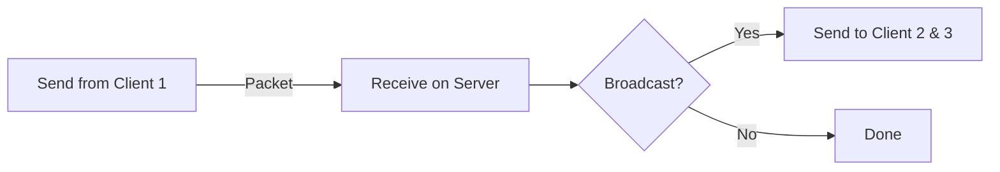

# Creating Fika-Compatible Mods

## Fika Events

Fika has a lot of events that you can subscribe to, which makes it easier to run code at certain key moments of the raid. To subscribe to an event, use:


```cs
/// <summary>
/// Subscribes a callback to a specific type of Fika event.
/// </summary>
/// <typeparam name="TEvent">The type of the event to subscribe to.</typeparam>
/// <param name="callback">The callback to invoke when the event is dispatched.</param>
public static void SubscribeEvent<TEvent>(Action<TEvent> callback) where TEvent : FikaEvent
```


To unsubscribe, use:


```cs
/// <summary>
/// Unsubscribes a callback from a specific type of Fika event.
/// </summary>
/// <typeparam name="TEvent">The type of the event to unsubscribe from.</typeparam>
/// <param name="callback">The callback to remove from the event subscription.</param>
public static void UnsubscribeEvent<TEvent>(Action<TEvent> callback) where TEvent : FikaEvent
```


The event triggered will usually pass an important object related to the event, e.g. `FikaNetworkManagerCreatedEvent` passes a `IFikaNetworkManager` (named `Manager` in the object). This object can then be accessed if needed.

You can read the source code [here](https://github.com/project-fika/Fika-Plugin/tree/main/Fika.Core/Modding) to find all events.

## Registering Packets

To register packets, subscribe to the `FikaNetworkManagerCreatedEvent` and access the `IFikaNetworkManager`. In the manager you can call either of these methods:


```cs
/// <summary>
/// Registers a packet to the <see cref="NetPacketProcessor"/>.
/// </summary>
/// <typeparam name="T">The packet type.</typeparam>
/// <param name="handle">The <see cref="Action"/> to run when receiving the packet.</param>
void RegisterPacket<T>(Action<T> handle) where T : INetSerializable, new();
```


<pre class="language-cs" data-overflow="wrap" data-full-width="false"><code class="lang-cs">/// &#x3C;summary>
/// Registers a packet to the &#x3C;see cref="NetPacketProcessor"/> with user data.
/// &#x3C;/summary>
/// &#x3C;typeparam name="T">The packet type.&#x3C;/typeparam>
/// &#x3C;typeparam name="TUserData">The user data type.&#x3C;/typeparam>
/// &#x3C;param name="handle">The &#x3C;see cref="Action"/> to run when receiving the packet.&#x3C;/param>
<strong>void RegisterPacket&#x3C;T, TUserData>(Action&#x3C;T, TUserData> handle) where T : INetSerializable, new();
</strong></code></pre>

The `INetSerializable` needs to be a packet that you have created, and these methods are invoked when that packet is received. The second method also passes the `NetPeer`, which is useful on the `FikaServer`. You handle the logic however you want when receiving the packet with these methods.


Failing to register a packet will result in endless `exceptions` being thrown. Please register your packets correctly!


## Creating a Packet

To create a packet, implement the `INetSerializable` interface into a new `class`. For packets that are sent often, I highly recommend using a `struct`. Add the data that you need in the form of `Field` and make all of them `Public`. Use the `Serialize()` and `Deserialize()` methods to write/read data. You can find an example [here](https://github.com/project-fika/Fika-Plugin/blob/main/Fika.Core/Networking/Packets/Communication/BotStatePacket.cs), which also includes how to write an `enum`. There are also a lot of extensions to write EFT/Unity specific data (e.g. `Vector3`) that you can find [here](https://github.com/project-fika/Fika-Plugin/blob/main/Fika.Core/Networking/FikaSerializationExtensions.cs).

Do not instantiate and send new collections in packets that are sent often, e.g. `List<T>` or `T[]`. The allocations will become expensive. Fika has an interface `IReusable` that you can use to reuse a single instance of a packet, and only mutate the collections that exist in it.


```csharp
/// <summary>
/// Registers a reusable packet to the <see cref="NetPacketProcessor"/> with user data. Reusable uses the same instance throughout the lifetime of the <see cref="NetManager"/>.
/// Custom types must be registered with <see cref="RegisterCustomType{T}(Action{NetDataWriter, T}, Func{NetDataReader, T})"/> first.
/// </summary>
/// <typeparam name="T">The packet type.</typeparam>
/// <typeparam name="TUserData">The user data type.</typeparam>
/// <param name="handle">The <see cref="Action"/> to run when receiving the packet.</param>
void RegisterReusable<T, TUserData>(Action<T, TUserData> handle) where T : class, IReusable, new();
```


An example of these packets can be found [here](https://github.com/project-fika/Fika-Plugin/blob/47a9d37aa40e2e7cc0b9628c7114115cd3805cd4/Fika.Core/Networking/Packets/World/WorldPacket.cs). Create the class somewhere, keep track of it and reuse it. You can find an example of that in the [FikaClientWorld](https://github.com/project-fika/Fika-Plugin/blob/47a9d37aa40e2e7cc0b9628c7114115cd3805cd4/Fika.Core/Main/ClientClasses/FikaClientWorld.cs).

## Sending a Packet

To send a packet, you need a `IFikaNetworkManager`. This is either a `FikaServer` or `FikaClient` that you can access with the `Comfort.Common` namespace using `Singleton<IFikaNetworkManager>.Instance`. To determine whether you are a server or client, use `FikaBackendUtils.IsServer`.

Use this method to send packets:


```cs
/// <summary>
/// Sends a packet.
/// </summary>
/// <typeparam name="T">The type of packet to send, which must implement <see cref="INetSerializable"/>.</typeparam>
/// <param name="packet">The packet instance to send, passed by reference.</param>
/// <param name="deliveryMethod">The delivery method (reliable, unreliable, etc.) to use for sending the packet.</param>
/// <param name="broadcast">If <see langword="true"/>, the packet will be sent to multiple recipients; otherwise, it will be sent to a single target (server is always broadcast).</param>
void SendData<T>(ref T packet, DeliveryMethod deliveryMethod, bool broadcast = false) where T : INetSerializable;
```


The `broadcast` argument determines whether it will be sent to _all other clients_. As the server, this is always `true`.

If you want to send to just one specific `NetPeer`, e.g. after receiving a packet and you want to respond to that peer:


```csharp
/// <summary>
/// Sends a packet of data directly to a specific peer.
/// </summary>
/// <typeparam name="T">The type of packet to send, which must implement <see cref="INetSerializable"/>.</typeparam>
/// <param name="packet">The packet instance to send, passed by reference.</param>
/// <param name="deliveryMethod">The delivery method (reliable, unreliable, etc.) to use for sending the packet.</param>
/// <param name="peer">The target <see cref="NetPeer"/> that will receive the packet.</param>
/// <remarks>
/// Should only be used as a <see cref="FikaServer"/>, since a <see cref="FikaClient"/> only has one <see cref="NetPeer"/>.
/// </remarks>
void SendDataToPeer<T>(ref T packet, DeliveryMethod deliveryMethod, NetPeer peer) where T : INetSerializable;
```





A client only has one `NetPeer` and it is _**always**_ the server! A client is never aware of other clients.


Some specific functions are class specific, and cannot be called from the interface singleton. You can access the specific `FikaServer` or `FikaClient` using e.g. `Singleton<FikaServer>.Instance`.

The specific methods are:

#### Client


```csharp
/// <summary>
/// Sends a reusable packet
/// </summary>
/// <typeparam name="T">The <see cref="IReusable"/> to send</typeparam>
/// <param name="packet">The <see cref="INetSerializable"/> to send</param>
/// <param name="deliveryMethod">The deliverymethod</param>
/// <remarks>
/// Reusable will always be of type broadcast when sent from a client
/// </remarks>
public void SendReusable<T>(T packet, DeliveryMethod deliveryMethod) where T : class, IReusable, new()
```


#### Server


```csharp
public void SendReusableToAll<T>(T packet, DeliveryMethod deliveryMethod, NetPeer peerToExlude = null) where T : class, IReusable, new()
```


***

## Inventory Replication

Fika will automatically replicate all inventory actions, as long as you pass the operation through the `InventoryController.vmethod_1`. Every player has an inventory controller property (`EFT.Player.InventoryController`), _**use it!**_ Even without Fika, do not try to cirumvent this method and always pass them through the controller.\
\
Each operation has a constructor you can find in the assembly. You can look at these to see how to properly create and execute and inventory operation. Do not call the result directly! Use it to create the operation (I've seen this mistake a lot in the past from mod developers), and run it on the controller.\
\
Some examples you can look for the subtypes of are: `IExecute`, `IRollback`, `IRaiseEvents`.


If you circumvent the intended way of executing inventory operations, you will inevitably cause desync!


***

## General Information About Data


Keep in mind that performance and bandwidth is not free! Do not send redundant data every `Update()` unless you have to.&#x20;

Fika has a class that you can inherit called `ThrottledMono`, where you can set an `UpdateRate` which is how many times it should update per second. This can dramatically increase performance and reduce bandwidth used.


### Calculating Packet Size (UDP with Headers)

When sending data over a network using UDP, each packet consists of:

1. Your payload (the actual data, e.g., floats)
2. Packet-specific overhead (1–4 bytes depending on the type, e.g. `Unreliable` or `ReliableOrdered`)
3. UDP header (8 bytes)
4. IP header (20–60 bytes, depending on IPv4 options)

It’s important to account for all headers, not just the payload, because small payloads can become inefficient due to header overhead.

#### Formula

Let:

* _**N**_ = number of elements being sent
* _**S**_<sub>element</sub> = size of one element in bytes (e.g., 4 bytes for a `float`)
* _**H**_<sub>packet​</sub> = packet-specific overhead (1–4 bytes)
* _**H**_<sub>UDPH​</sub> = UDP header size (8 bytes)
* _**H**_<sub>IPH</sub>​ = IP header size (20–60 bytes)

Then, the **total packet size in bytes** is:

$$
\text{Packet Size (bytes)} = N \times S_{\text{element}} + H_{\text{packet}} + H_{\text{udp}} + H_{\text{ip}}
$$

To convert to **bits**:

$$
\text{Packet Size (bits)} = 8 \times \Big( N \cdot S_{\text{element}} + H_{\text{packet}} + H_{\text{udp}} + H_{\text{ip}} \Big)
$$

***

#### Example

Suppose you are sending a `Vector3`, which is 3 floats (4 bytes each), with 2 bytes of packet-specific overhead, 8 bytes UDP header, and 20 bytes IP header:

$$
Packet Size=3×4+2+8+20=42 bytes
$$

$$
Packet Size in bits=42×8=336 bits
$$

Even this small payload, if sent frequently (e.g., every frame in a game), can consume significant bandwidth. Notice that even though the payload is only 12 bytes, headers increase the total packet size almost _**4×**_.\
\
Now imagine this being unthrottled, and the client is running at 120 FPS:

<mark style="color:$primary;">We already have:</mark>

$$
Packet Size=42 bytes
$$

<mark style="color:$primary;">If we send 120 packets per second:</mark>

$$
Data per second (bytes)=42×120
$$

#### Step-by-step

* Packet size is 42 bytes.
* Sending 120 packets per second.
* Multiply packet size by number of packets: 42 × 120.

<mark style="color:$primary;">Break it down:</mark>&#x20;

$$
42×120=42×(12×10)=(42×12)×10
$$

$$
42×12=504
$$

$$
504×10=5,040
$$

<mark style="color:$primary;">Convert to bits:</mark>

$$
5,040×8=40,320 bits per second (bps)
$$

This is _**a lot**_ of wasted bandwidth and CPU usage. Unless it's critical, do not send data every tick. Rather, interpolate values on the receiving end if needed. Breaking it down further:

$$
Data transferred=5KB/s×60s=300KB
$$

That is 300KB per minute for _**one**_, _**single**_ `Vector3`. That is almost ¼ of the bandwidth that Fika sends for _**all bots states**_ every minute.

<mark style="color:$primary;">The size of one entire player state (52 bytes), 20/s:</mark>

$$
52×20=1040bytes/sec per entity
$$

<mark style="color:$primary;">Assuming we have 20 bots:</mark>

$$
1040×20=20,800bytes/sec total
$$

<mark style="color:$primary;">Now per minute:</mark>

$$
20,800×60=1,248,000bytes/minute ≈ 1,248MB/minute (1.19 MiB)
$$

***

### Interpolation

As you can see from the breakdown, this is a lot of wasted data that could be throttled and sent less frequently, and potentially interpolated instead by lerping the values and sending the time when sending and comparing with the time when received.

<mark style="color:$primary;">Interpolation factor</mark> <mark style="color:$primary;"></mark>_<mark style="color:$primary;">**t**</mark>_<mark style="color:$primary;">:</mark>

$$
t = \frac{\text{currentTime} - \text{sentTime}}{\text{receivedTime} - \text{sentTime}}
$$

<mark style="color:$primary;">Clamp</mark> <mark style="color:$primary;"></mark>_<mark style="color:$primary;">**t**</mark>_ <mark style="color:$primary;"></mark><mark style="color:$primary;">between 0 and 1:</mark>

$$
t = \max(0, \min(1, t))
$$

<mark style="color:$primary;">Linear interpolation formula:</mark>

$$
\text{lerpedValue} = \text{oldValue} + (\text{newValue} - \text{oldValue}) \cdot t
$$

You can then send the current time (`Time.unscaledTime`) and compare it with current time when received, and smooth out differences using the equations above.

#### Now comparing the different methods of sending

<mark style="color:$primary;">20 messages/sec at 16 bytes:</mark>

$$
16 \times 20 = 320\ \text{bytes/sec}
$$

<mark style="color:$primary;">120 messages/sec at 12 bytes:</mark>

$$
12 \times 120 = 1{,}440\ \text{bytes/sec}
$$

<mark style="color:$primary;">That is \~1080bytes saved per second:</mark>

$$
1{,}440 - 320 = 1{,}120\ \text{bytes/sec}
$$

### Summary

By combining **time synchronization** with **lerp-based smoothing**, we can create fluid, latency-tolerant motion without spamming the network.\
Instead of sending full position updates every frame, we send fewer messages that include a timestamp and interpolate locally:

$$
\text{lerpedValue} = (1 - t) \cdot \text{oldValue} + t \cdot \text{newValue}
$$

This allows clients to smoothly reconstruct movement based on timing differences rather than raw frequency.

For example, reducing from **120 messages/sec at 12 bytes** to **20 messages/sec at 16 bytes** saves:

$$
1{,}440 - 320 = 1{,}120\ \text{bytes/sec}
$$

While **1,12 KB/sec** per stream might seem small, it scales quickly — each actor can send multiple data streams (position, rotation, animation state, etc.), and with many actors, the savings multiply dramatically.

Optimizing send frequency and payload size is one of the most effective ways to achieve **smooth, efficient, and scalable networked movement**.


This approach doesn’t just apply to movement — it’s equally useful for synchronizing any time-based value, such as animations, UI transitions, physics states, or even audio parameters.


## Tips and useful classes

* [FikaBackendUtils](https://github.com/project-fika/Fika-Plugin/blob/main/Fika.Core/Main/Utils/FikaBackendUtils.cs) has tons of useful methods/properties/fields that can be used.
* [FikaGlobals](https://github.com/project-fika/Fika-Plugin/blob/main/Fika.Core/Main/Utils/FikaGlobals.cs) has some helper methods that can be useful during development.
* [CoopHandler](https://github.com/project-fika/Fika-Plugin/blob/main/Fika.Core/Main/Components/CoopHandler.cs) has useful properties and methods, mainly to track players (especially human). It can be accessed on the `Singleton<IFikaNetworkManager>.Instance` or [CoopHandler.TryGetCoopHandler()](https://github.com/project-fika/Fika-Plugin/blob/18f02d5713b0e13cc02998b9e79489a55ac8249d/Fika.Core/Coop/Components/CoopHandler.cs#L62) depending on your code style preference.
* [FikaSerializationExtensions](https://github.com/project-fika/Fika-Plugin/blob/main/Fika.Core/Networking/FikaSerializationExtensions.cs) have tons of good extension methods to handle data, e.g. packing a `float`. If precision is not important to the last decimal, it's recommended to pack your primitives.
