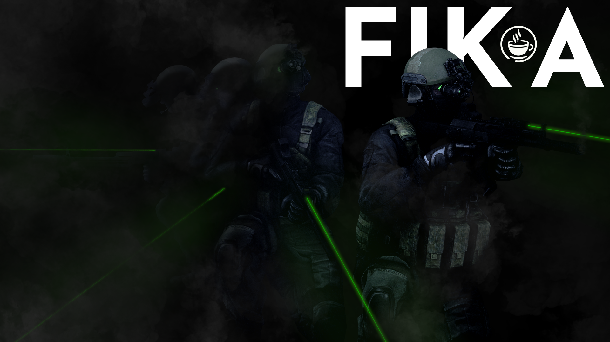

# Home

<figure><figcaption></figcaption></figure>

## Introduction

Project Fika is an unofficial SPT mod designed to enable co-op multiplayer gameplay with your friends in Escape from Tarkov. You can progress through quests, share items, and fight AI bots (PMCs, SCAVs, and Bosses) together.

The backend infrastructure (characters, inventory, quests, trading, etc.) is handled by the Escape From Tarkov backend server emulator [Single Player Tarkov (SPT)](https://sp-tarkov.com).


Project Fika is **NOT** an official SPT mod. Do not contact the SPT team for support inquiries if you're using Fika. Join our [Discord](https://discord.gg/project-fika) for assistance.


## Quick links

* [Getting started with Fika](installing-fika.md) - Learn how to install Fika and play with your friends
* [Github page](https://github.com/project-fika) - Contribute to Fika
* [Fika Discord](https://discord.gg/project-fika) - Be part of the Fika community

## License

This project is licensed under [CC BY-NC-SA 4.0](https://creativecommons.org/licenses/by-nc-sa/4.0/legalcode.en).

* You may only share/create derivatives of Fika as long as proper credits are given and it is not used for commercial purposes.
* You may not monetize your server in terms of payments or donations.
* You may not host massive public servers, Fika is meant for COOP with your friends.
* You may not use Fika's **art assets** that are handcrafted by our developers and artists without permission from the creator.
