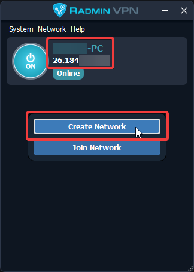

# FAQ

## General Common Issues

### I changed `http.json` but my server still says `0.0.0.0`

* There is no longer any need to edit `http.json` (or anything else) in `SPT_Data\` — anything entered in `http.json` is overwritten by the `ip` and `backendIp` values in `user/mods/fika-server/assets/configs/fika.jsonc`.
  * Server mod configuration wiki page [here](fika-configuration/server.md).
* You must run `SPT.Server.exe` at least once with `fika-server` installed for `fika.jsonc` to generate.
  * The upside of this change is that you will no longer have any configuration settings overwritten when updating SPT or Fika.
* SPT 3.11 has moved to **`https`** so make sure the URL in everyone's `SPT.Launcher.exe` begins with `https://`.

### I do not see my friend(s) on the Online Players list on the main menu

* Only one person in the group launches `SPT.Server.exe`.
* Decide which person is the server host. That person alone runs `SPT.Server.exe` and follows the [Hosting a Fika server](hosting-a-fika-server/) instructions.

### My friend is getting an error about open ports when trying to join my raid

#### If your group is using Radmin VPN (or any other VPN client)

* Whoever clicks the `HOST RAID` button needs to follow these instructions exactly as they are written:
  * Navigate to the Fika.Core plugin settings in your F12 configuration menu and scroll down to the Network header. Select your own VPN IP from the Force Bind IP dropdown selection box, then type that same exact IP in the Force IP box just above. Also verify that the settings Use UPnP and Use NAT Punching are both unchecked/disabled.

#### If your group is port forwarding

* Whoever clicks the `HOST RAID` button needs to ensure that they have port forwarded 25565/udp in their router. The raid is hosted by the person who presses `HOST RAID`, not by the `SPT.Server` host.

#### If you are using headless client

* If you are using the headless client to host raids and you are getting this error, you need to make sure the headless client is set up to accept incoming connections the same way any normal client would be. 
* **If you are port forwarding**, your port forward rule for 25565/udp needs to go to the PC that is running the headless client. 
* **If you are using a VPN**, you need to open up your `<headless install>/BepInEx/config/com.fika.core.cfg` in a text editor and make sure the VPN IP of the headless client machine is set for both `Force IP` and `Force Bind IP`. The VPN client must also be installed and configured on the headless client PC as well.

### I cannot see SPT chat bots like Commando / I cannot create the type of profile I want / I cannot enable quest sharing in F12

* Review the Fika-Server mod [configuration options](fika-configuration/server.md).

### I cannot use transits

* Transits are disabled with Fika for SPT 3.11.x unless you are using a [headless client](advanced-features/headless-client.md) as a raid host.
* Simply because transits are fragile & host migration is complex, transits are currently disabled under most circumstances. If you are just trying to complete quests that require transiting from one map to another, you can utilize a mod like [Skipper](https://hub.sp-tarkov.com/files/file/1861-skipper/) to mark those quests complete. Play both raids, complete the task to the best of your ability, then skip it. Or just ignore these quests. You can also solve this with the mod [No Transit Tasks](https://hub.sp-tarkov.com/files/file/2616-no-transit-tasks/).

## Headless Client Common Issues

### The headless client launch script just opens and closes

* Run the following command in Powershell:&#x20;

```powershell
Set-ExecutionPolicy -ExecutionPolicy RemoteSigned
```

### I get an error popup about `A patch in SPTCustomPlugin FAILED` when starting the headless client

#### The type initializer for `SPT.Custom.Patches.CustomAiPatch`...

* Make sure `SPT.Server.exe` is running and loaded and able to be connected to. Your headless client is not able to connect to the backend server. Make sure the server is running and the `BackendUrl` at the top of the launch .ps1 script is correct. Also make sure you are not running `_TEMPLATE.ps1`, the launch script should be named `Start_headless_someuid.ps1`.
  * SPT.Server.exe and headless client on the same machine:
    * If you're using a VPN, `BackendUrl` should be `https://your.vpn.ip.addr:6969`.
    * If you're port forwarding, `BackendUrl` should be `https://127.0.0.1:6969`.
  * SPT.Server.exe and headless client are on different machines:
    * Within the same network, `BackendUrl` should be `https://your.LAN.IPv4.addr:6969`,
    * Different network, `BackendUrl` should either be `https://your.vpn.ip.addr:6969` (VPN) or `https://some.pub.lic.ip:6969` (port forwarding).

#### The type initializer for `SPT.Custom.Patches.EasyAssetsPatch`...

* Copy these two DLL files from your working and already-launched SPT install to your headless client.

<figure><figcaption></figcaption></figure>

