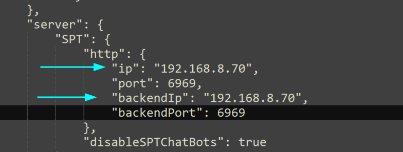

# Host over LAN

Hosting over LAN allows you to play with someone in the same house/network without internet access and without any real port forwarding other than allowing the application in your local firewall.

## Obtain your local IP

Your local IP address will be required to host over LAN. Follow the steps below to obtain it.

* Press the `Windows key` and type `cmd`.

<figure><figcaption></figcaption></figure>

* Type `ipconfig` and then press `enter` in the command prompt.
* Find the network adapter you are using (Ethernet or Wi-Fi). There can be multiple Ethernet adapter - make sure you identify the correct one.
* Find the IPv4 Address entry and take note of the IP address, e.g `192.168.0.152`. This will be referred to as `your_lan_ip` below.

<figure><figcaption><p>Your local IP address should appear under Ethernet adapter (if your connection is wired)</p></figcaption></figure>

## Configure Windows Firewall

Installing Fika using Fika-Installer will automatically configure the Windows Firewall.

## Set your local IP in Fika

* Start `SPT.Server.exe` at least once to generate the configuration files, then close it.
* Navigate to your `user\mods\fika-server\assets\configs` and open `fika.jsonc`.
* Find the `server` section.
* Change `ip` to `your_lan_ip`.
* Change `backendIp` to `your_lan_ip`.
* Save the file and close it.

<figure><figcaption></figcaption></figure>

* Launch `SPT.Server.exe`.

If everything is working properly, you should see something similar in the console output:

```
ModLoader: loading: 1 server mods...
Mod: server version: 2.4.0 by: Fika loaded
Server: executing startup callbacks...
Importing database...
Database import finished
Started webserver at https://<your_lan_ip>:6969
Started websocket at wss://<your_lan_ip>:6969
Server is running, do not close while playing SPT, Happy playing!!
```


If you see errors (red text) then your configuration is invalid or you are unable to host using the configured IP address/port.


* Start the game using `SPT.Launcher.exe`.
* Once you are in the main menu, press `F12` to bring up the configuration manager.
* Find the Force IP and Force Bind IP in the "Fika.Core" section of the configuration manager.
* Set both Force IP and Force Bind IP to your LAN IP.

<figure><figcaption></figcaption></figure>

## Testing connectivity

* Ask your friend(s) to ping your local IP address from a computer within the same local network

If the ping fails then it means that you grabbed the wrong local IP address or that your network configuration is invalid. Validate your network settings.

## Hosting a raid

Your Fika instance is now ready to host a raid.

* [Click here](../playing-fika.md#hosting-a-raid) to learn how to host a raid.
* [Click here](../fika-configuration/) to learn more about additional Fika configurations.
