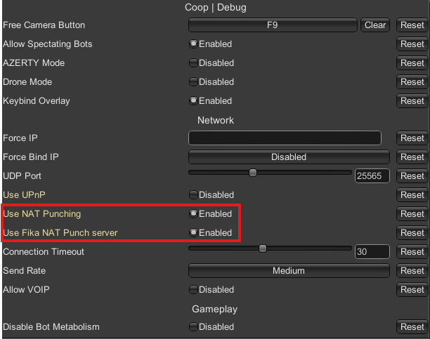
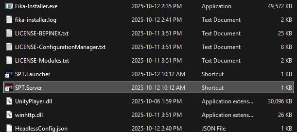

# Host using a VPN

A Virtual Private Network (VPN) enables you to join the same network via a public centralized server. You can either use a free VPN service such as [Radmin](https://www.radmin-vpn.com/) or set up your own VPN. This method is recommended only as a last resort if you are unable to use port forwarding.

This guide will use Radmin as the VPN client. It is able to establish a direct connection if your network allows it, providing the best performance possible.


Free VPNs services are known to cause performance or connectivity problems, so use at your own risk. The officially supported way of playing Fika is with port forwarding. We will not provide support for issues caused by VPN services.

Custom firewalls such as **BitDefender** may also block your connection while playing. Make sure that you allow the connection or temporarily disable it while playing!

You may also experience issues if you are using another VPN service, even if it is disabled. If you have problems, consider uninstalling any other virtual network adapters.


## Installing the Radmin VPN client

* Navigate to the [Radmin website](https://www.radmin-vpn.com/) and download the Radmin VPN client.
* Run the installer and proceed with the installation steps.
* Reboot your computer. This is important to ensure that the virtual network adapter is correctly installed. **Do not skip this step!**
* Open Radmin VPN client (from the taskbar or from the start menu).
* Click `Create network`.

<figure><figcaption></figcaption></figure>

* Enter a network name (can be anything - make sure to remember it. You need to share it with your friends).
* Enter a password.
* Click `Create`.

<figure><figcaption></figcaption></figure>

* Take note of your `VPN IP`, which is displayed below your computer name in Radmin. It will be referred to as `your_vpn_ip` in the following steps.

<figure><figcaption></figcaption></figure>

* Go to `System` -> `Firewall Exceptions` and click  `Allow All Apps`.

<figure><figcaption></figcaption></figure>

## Testing connectivity

* Ask your friend(s) to follow the steps [here](../joining-a-fika-server/join-using-a-vpn.md).
* Right-click their name in Radmin and click `Ping`.

<figure><figcaption></figcaption></figure>

* Close the command prompt when ping is successful.


If the ping fails then it means that the VPN connection is not working correctly. Everyone should try rebooting their PC and make sure that everyone joined the same network in Radmin.

Custom firewalls such as `BitDefender` can block VPN communication - try turning it off.


## Ensuring direct connection

It is important to ensure that you are communicating directly with your friend(s) through Radmin for optimal performance.

* Right-click your friend's name in Radmin and click `Properties`.

<figure><figcaption></figcaption></figure>

* Validate that the Channel type is `TCP/out`. This mean you have a direct connection to this peer.

<figure><figcaption></figcaption></figure>


If you see `TCP/relay`, then the communication is relayed through Radmin's servers. The performance will be severely degraded. Try disabling any firewall and/or antivirus in your system and reconnect to the network in Radmin.


## Configure your `VPN IP` in Fika

* Start `SPT.Server` at least once to generate the configuration files, then close it.

<figure><figcaption></figcaption></figure>

* Navigate to `user\mods\fika-server\assets\configs`.
* Open `fika.jsonc` with your preferred text editor (Notepad++ is recommended).

<figure><figcaption></figcaption></figure>

* Find the `server` section.
* Change `ip` to `your_vpn_ip`. Make sure to write it inside the quotes.
* Change `backendIp` to `your_vpn_ip`. Make sure to write it inside the quotes.

<figure><figcaption></figcaption></figure>

* Save the file and close it.
* Start `SPT.Launcher`

<figure><figcaption></figcaption></figure>

* Click the `Settings` button.

<figure><figcaption></figcaption></figure>

* Check the `Developer mode` box.
* Enter your VPN address in the URL section. DO NOT leave out `https://` and do not add a slash at the end. The URL box should look like this: `https://20.21.22.23:6969`.

<figure><figcaption></figcaption></figure>

* Press the arrow on the right corner.
* You should now be able to create your profile and log in to the server.
* Start the game.

<figure><figcaption></figcaption></figure>

* Press `F12` when in-game to bring up the configuration manager.
* Find the `Force IP` and `Force Bind IP` in the `Fika.Core` section of the configuration manager.
* Set both Force IP and Force Bind IP to `your_vpn_ip`.

<figure><figcaption></figcaption></figure>


Note: Players willing to host a raid will also need to set the `Force IP` and `Force Bind IP` in their respective Fika configuration.


## Hosting a raid

[Click here](../playing-fika.md#hosting-a-raid) to learn how to host a raid.

[Click here](../fika-configuration/) to learn more about additional Fika configurations.
