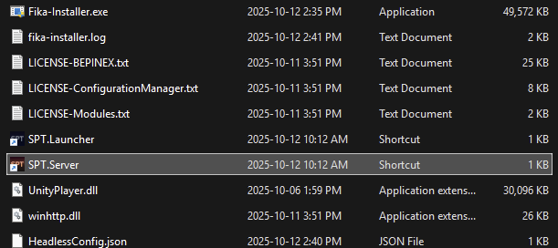

# Host using a VPN


**WARNING**

Free VPNs services are known to cause performance or connectivity problems, so <mark style="color:$warning;">use at your own risk</mark>.&#x20;

The officially supported way of playing Fika is with port forwarding. We will not provide support for issues caused by VPN services.

Custom firewalls such as **BitDefender** may also block your connection while playing. Make sure that you allow the connection or temporarily disable it while playing!

You may also experience issues if you are using another VPN service, even if it is disabled. If you have problems, consider uninstalling any other virtual network adapters.




### Download Radmin

Navigate to the [Radmin website](https://www.radmin-vpn.com/) and download the Radmin VPN client.



### Install Radmin

Run the installer and proceed with the installation steps.



### Reboot your computer

This is important to ensure that the virtual network adapter is correctly installed. **Do not skip this step!**



### Create a network in Radmin

Open Radmin VPN client (from the taskbar or from the start menu) an Click `Create network`.

<figure><figcaption></figcaption></figure>

Enter a network name and a password. Make sure to note the network name and password, you will need to share it with your friends.

<figure><figcaption></figcaption></figure>




### Add Radmin to Windows firewall exclusions

Go to `System` -> `Firewall Exceptions` and click  `Allow All Apps`.

<figure><figcaption></figcaption></figure>



### Start `SPT.Server` to generate the config file

Wait for `SPT Server` to be fully loaded.

<figure><figcaption></figcaption></figure>



### Close `SPT.Server`



### Open Fika config in editor

Navigate to `<SPT install>\SPT\user\mods\fika-server\assets\configs`.

Open `fika.jsonc` with your preferred text editor (Notepad++ is recommended).




### Start `SPT.Server`

Wait for `SPT Server` to be fully loaded.

<figure><figcaption></figcaption></figure>




### Start `SPT.Launcher`

<figure><figcaption></figcaption></figure>



### Edit the SPT Launcher settings

Click `Add New Server`

<figure><figcaption></figcaption></figure>

Pick a name for your server and then in the address write `127.0.0.1:6969`

<figure><figcaption></figcaption></figure>



### Login to your profile



### Start the game

Press the arrow on the right corner. You should now be able to create your profile and log in to the server. Start the game.

<figure><figcaption></figcaption></figure>



<a href="../testing-connectivity/test-vpn-connectivity/" class="button primary" data-icon="circle-right">I followed all the steps</a>

