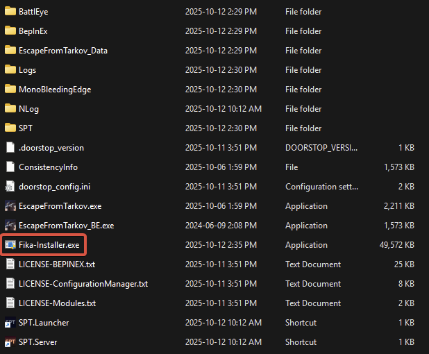

# Installing Fika

## Before installing Fika

**Always** keep in mind that Fika is a [SPT](https://sp-tarkov.com/#download) mod. You **must** have a working SPT installation before attempting to install Fika.

This means that you must be able to start a game in SPT without any issues, and you should not be running any mods before installing Fika. Please ensure this is the case before continuing with the next steps.


If you are unsure how to install SPT, please follow their instructions [here](https://forge.sp-tarkov.com/installer) and come back here once they are completed. Again, make sure that your SPT installation works before continuing.


We recommend reading the [General information](../General-information.md) section so you have a better understanding of how Fika works.

## Prerequisites

* You must have an up-to-date and working installation of [SPT](https://forge.sp-tarkov.com/installer) **with no mods installed**.
  * You will be able to install SPT mods later, but it is important to get Fika working without mods first.
* Bleeding edge versions of SPT are _**NOT**_ supported by Fika.
* Locate your SPT installation folder. This will be referred to as `SPT folder` in the steps below.

## Hardware Requirements

* **CPU**: i7 8700k / Ryzen 5 3600X
* **GPU**: GTX 2070 / RX 5700 XT
* **Memory**: 32 GB RAM
* **Storage**: SSD is mandatory, no support is given for installations on a HDD

The biggest gain in Fika (and in SPT in general) will be getting a stronger CPU and RAM. The AMD X3D series will provide the best performance due to the cache speed.

## Installation



#### Install [SPT](https://forge.sp-tarkov.com/installer)

A fresh installation of SPT is **required** before installing Fika. **Do not install mods yet!**



#### Download [Fika-Installer](https://github.com/project-fika/Fika-Installer/releases/latest)



#### Copy `Fika-Installer.exe` to the root of your SPT install folder

Do not copy inside `SPT` folder!

<figure><figcaption></figcaption></figure>



#### Start `Fika-Installer.exe`

If you get an admin rights prompt, this is normal. Fika-Installer requires admin rights to set up the firewall rules.



#### Choose `Install Fika`

<figure><figcaption></figcaption></figure>



#### Close `Fika-Installer` when installation is completed

<figure><figcaption></figcaption></figure>



#### Start `SPT.Server`

<figure><figcaption></figcaption></figure>

You should see `Mod: server version: x.x.x (targets SPT: 4.x.x) by: Fika loaded`.

<figure><figcaption></figcaption></figure>



#### Start `SPT.Launcher`

<figure><figcaption></figcaption></figure>




#### Create or login to your account then start the game

<figure><figcaption></figcaption></figure>

<figure><figcaption></figcaption></figure>



#### Validate that Fika successfully loaded

`FIKA x.x.x | SPT x.x.x` should appear at the bottom left corner of the main menu. You should also see the `Online players` widget on the right side of the main menu.

<figure><figcaption></figcaption></figure>



#### Exit the game and continue with the next steps



***

## Setting up Fika

In order to host or join a Fika server, you must follow the necessary steps.

[Click here](../hosting-a-fika-server/) if you're hosting a Fika server.

[Click here](../joining-a-fika-server/) if you're joining a Fika server.
