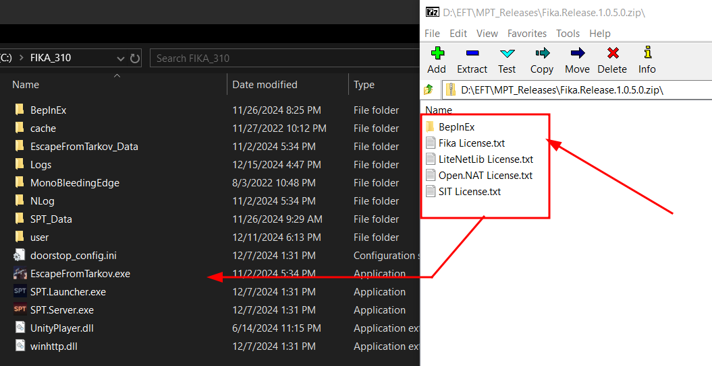
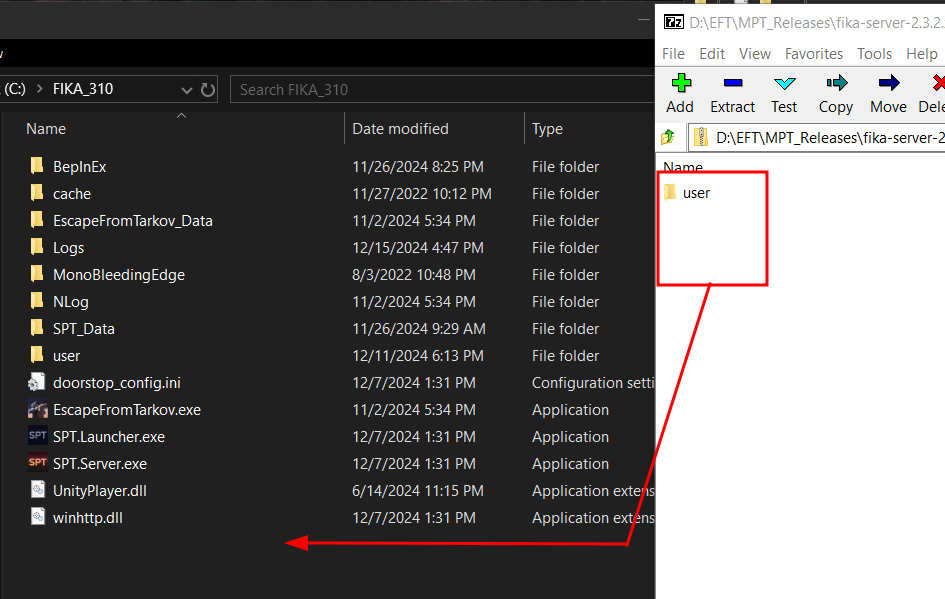
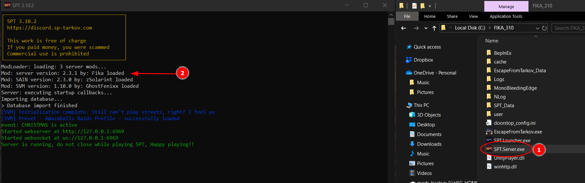
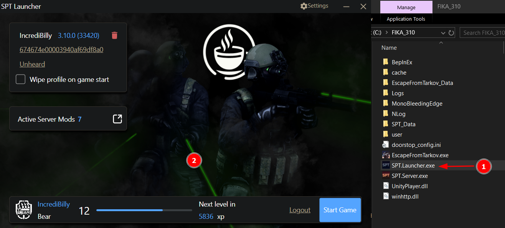
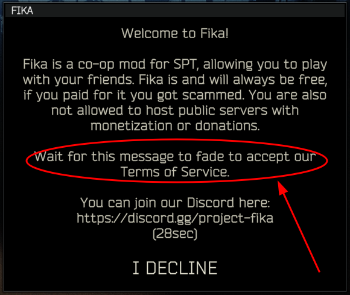
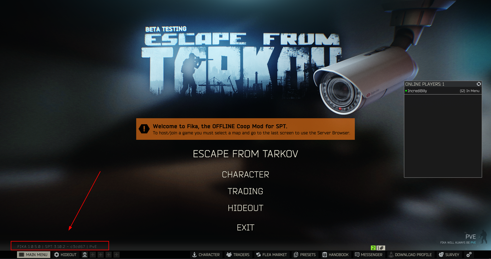

---
layout:
  title:
    visible: true
  description:
    visible: true
  tableOfContents:
    visible: true
  outline:
    visible: true
  pagination:
    visible: false
---

# Installing Fika

## Before installing Fika

**Always** keep in mind that Fika is an unofficial [SPT](https://sp-tarkov.com/#download) mod. You **must** have a working SPT installation before attempting to install Fika. There is absolutely no point in trying to install Fika before you ensure that SPT is working first.

This means that you must be able to start a game in SPT without any issues, and you should not be running any mods before installing Fika. Please ensure this is the case before continuing with the next steps.


If you are unsure how to install SPT, please follow their instructions [here](https://hub.sp-tarkov.com/files/file/672-spt-installer/) and come back here once they are completed. Again, make sure that your SPT installation works before continuing.


We recommend reading the [General information](../General-information.md) section so you have a better understanding of how Fika works.

## Prerequisites

* You must have an up-to-date and working installation of SPT **with no mods installed**.
* Bleeding edge versions of SPT are _**NOT**_ supported by Fika.
* Identify your SPT installation folder. This will be referred to as `SPT folder`.

## Installation



### Download Fika-Plugin





### Download Fika-Server





### Extract Fika-Plugin to your SPT folder

<figure><figcaption></figcaption></figure>



### Extract Fika-Server to your SPT folder

<figure><figcaption></figcaption></figure>



### Start `SPT.Server.exe`

You should see: `Mod: server version: <Fika version> by: Fika loaded` in the console window. If you don't see it, you did not extract Fika-Server in the correct location.

<figure><figcaption></figcaption></figure>



### Start `SPT.Launcher.exe`

Create and/or login to your account, then start the game.

<figure><figcaption></figcaption></figure>



### Validate that Fika successfully loaded

You should get a Fika disclaimer upon entering the menu. Read the disclaimer and wait until the timer runs out.

<figure><figcaption></figcaption></figure>

<figure><figcaption></figcaption></figure>



### Exit the game and continue with the next steps



## Setting up Fika

In order to host or join a Fika server, you must follow the necessary steps.

[Click here](hosting-a-fika-server/) if you're hosting a Fika server.

[Click here](joining-a-fika-server/) if you're joining a Fika server.
