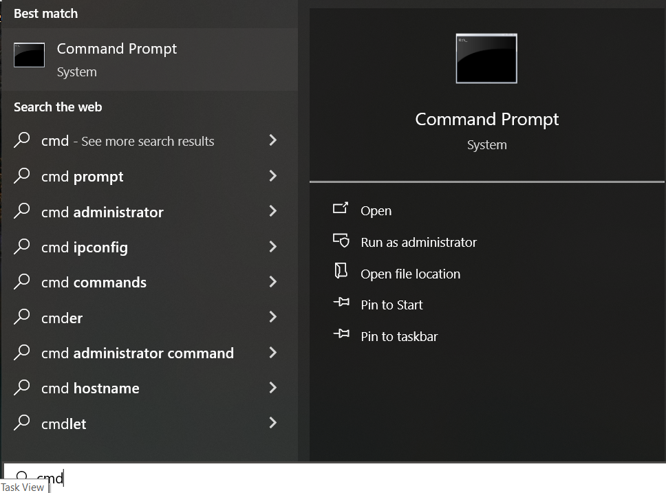
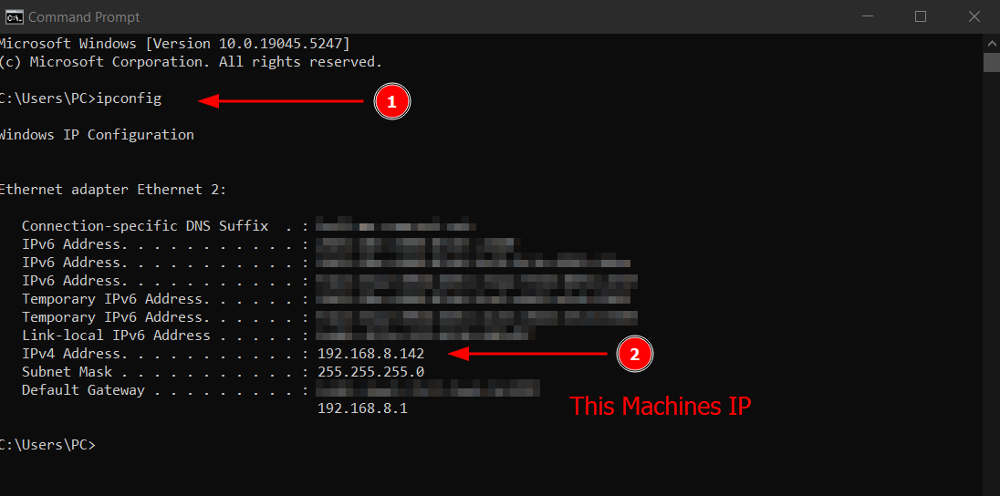
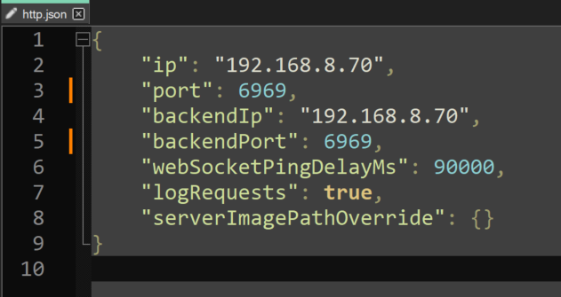
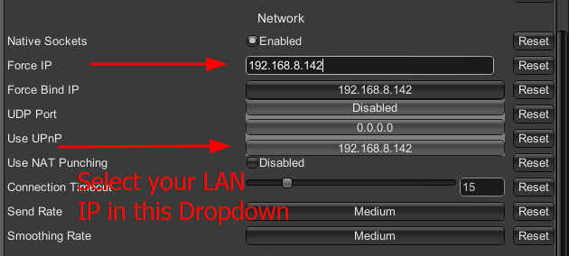

---
layout:
  title:
    visible: true
  description:
    visible: true
  tableOfContents:
    visible: true
  outline:
    visible: true
  pagination:
    visible: false
---

# Host over LAN

Hosting over LAN allows you to play with someone in the same house/network without internet access and without any real port forwarding other than allowing the application in your local firewall.

Your local IP address will be required to host over LAN. Follow the steps below to obtain it.

* Press the `Windows key` and type `cmd`.

<figure><figcaption></figcaption></figure>

* Type `ipconfig` and then press `enter` in the command prompt.&#x20;
* The IP listed in IPv4 is what you will need for the next section, e.g. `192.168.0.152.` It will be referred to as `your_lan_ip`.

<figure><figcaption><p>Your local IP address should appear under Ethernet adapter (if your connection is wired)</p></figcaption></figure>

### SPT/Fika configuration

* Navigate to your `<SPT Folder>\SPT_Data\Server\configs` and open `http.json`.
* Change `ip` to `your_lan_ip`.
* Change `backendIp` to `your_lan_ip`.
* Save the file and close it.

<figure><figcaption><p>Example of a proper local IP address configuration in http.json</p></figcaption></figure>

### Windows Firewall

You will need to configure the Windows Firewall to allow inbound traffic to the port 6969 TCP and 25565 UDP. If you don't know how, you can use [FikaUtils](https://github.com/Lacyway/FikaUtils/releases/latest).

### Last steps

Launch `SPT.Server.exe`.

If everything is working properly, you should see something similar in the console output:

```
ModLoader: loading: 1 server mods...
Mod: server version: 2.4.0 by: Fika loaded
Server: executing startup callbacks...
Importing database...
Database import finished
Started webserver at https://<your_lan_ip>:6969
Started websocket at wss://<your_lan_ip>:6969
Server is running, do not close while playing SPT, Happy playing!!
```


If you see errors (red text) then that means your configuration is invalid or you are unable to host using the configured IP address/port.


* Launch `SPT.Launcher.exe`.
* Start the game.
* Once you are in the main menu, press `F12` to bring up the configuration manager.
* Find the Force IP and Force Bind IP in the "Fika.Core" section of the configuration manager.
* Set both Force IP and Force Bind IP to your LAN IP. <- THIS IS A VERY IMPORTANT STEP, DO NOT SKIP IT.

<figure><figcaption></figcaption></figure>

At this point, your server should be accessible to your friends, and you can start playing.

Your friends will need to [install Fika](../) as well and follow the steps to [join a Fika server](../joining-a-fika-server/).

[Click here](../../Playing-Fika.md#hosting-a-raid) to learn how to host a raid.

[Click here](../../fika-configuration/) to learn more about additional Fika configurations.
