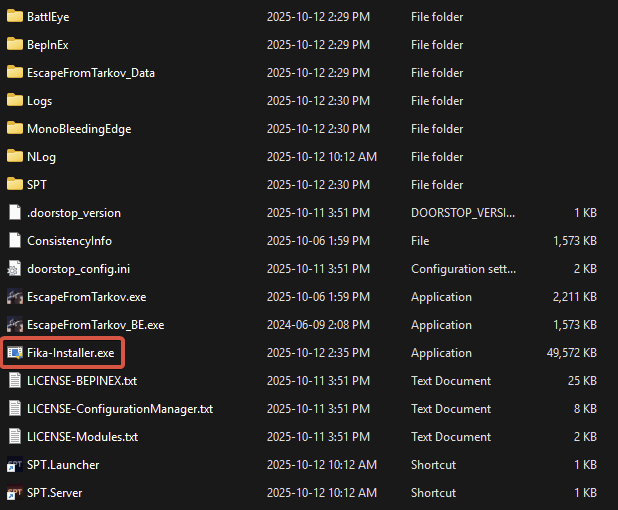

---
layout:
  width: default
  title:
    visible: true
  description:
    visible: false
  tableOfContents:
    visible: true
  outline:
    visible: false
  pagination:
    visible: false
  metadata:
    visible: false
---

# Installation steps



### Download [Fika-Installer](https://github.com/project-fika/Fika-Installer/releases/latest)



### Copy `Fika-Installer.exe` to the root of your SPT install folder

Do not copy inside `SPT` folder!

<figure><figcaption></figcaption></figure>



### Start `Fika-Installer.exe`

If you get an admin rights prompt, this is normal. Fika-Installer requires admin rights to set up the firewall rules.



### Choose `Install Fika`

<figure><figcaption></figcaption></figure>



### Close `Fika-Installer` when installation is completed

<figure><figcaption></figcaption></figure>



### Start `SPT.Server`

<figure><figcaption></figcaption></figure>

You should see `Mod: server version: x.x.x (targets SPT: 4.x.x) by: Fika loaded`.

<figure><figcaption></figcaption></figure>



### Start `SPT.Launcher`

<figure><figcaption></figcaption></figure>



### Create or login to your account then start the game

<figure><figcaption></figcaption></figure>

<figure><figcaption></figcaption></figure>



### Validate that Fika successfully loaded

`FIKA x.x.x | SPT x.x.x` should appear at the bottom left corner of the main menu. You should also see the `Online players` widget on the right side of the main menu.

<figure><figcaption></figcaption></figure>



### Exit the game



<a href="hosting-or-joining.md" class="button primary" data-icon="circle-right">Continue</a>

