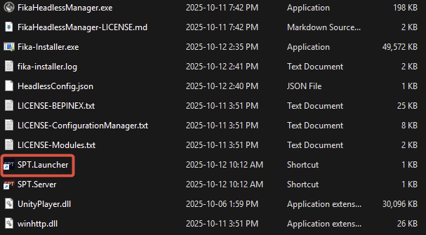

# Connect using a VPN


Free VPNs services are known to cause performance or connectivity problems, so use at your own risk. The officially supported way of playing Fika is with port forwarding. We will not provide support for issues caused by VPN services.

Custom firewalls such as **BitDefender** may also block your connection while playing. Make sure that you allow the connection or temporarily disable it while playing!

You may also experience issues if you are using another VPN service, even if it is disabled. If you have problems, consider uninstalling any other virtual network adapters.




### Download Radmin client

Navigate to the [Radmin website](https://www.radmin-vpn.com/) and download the Radmin VPN client.



### Install Radmin client

Run the installer and proceed with the installation steps.



### Reboot your computer

This is important to ensure that the virtual network adapter is correctly installed. **Do not skip this step!**



### Open Radmin

Open Radmin VPN client from the taskbar or from the start menu.



### Join the server host's Radmin network

Click `Join network`.

<figure><figcaption></figcaption></figure>

Enter the network name and password used by the server host.

<figure><figcaption></figcaption></figure>



### Validate that you can see server host

You should now be able to see the list of connected peers including the host.

<figure><figcaption></figcaption></figure>



### Add Radmin to Windows firewall exclusions

Go to `System` -> `Firewall Exceptions` and click  `Allow All Apps`.

<figure><figcaption></figcaption></figure>



### Start `SPT.Launcher`

<figure><figcaption></figcaption></figure>



### Open `SPT Launcher` settings

Click the `Settings` button.

<figure><figcaption></figcaption></figure>



### Configure the VPN IP in `SPT Launcher`

Check the `Developer Mode` box.

<figure><figcaption></figcaption></figure>

Enter the host's VPN address in the URL section. **DO NOT** leave out `https://`, do not forget to append the port `:6969` and do not add a slash at the end. The URL box should look like this: `https://20.21.22.23:6969`.

<figure><figcaption></figcaption></figure>

Press the arrow on the right corner.

<figure><figcaption></figcaption></figure>



### Create your profile




### Start the game

<figure><figcaption></figcaption></figure>



<a href="ensuring-direct-connection.md" class="button primary" data-icon="circle-right">I confirm I was able to connect to the server</a>

