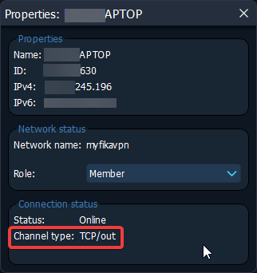

# Join using a VPN

## Install the Radmin VPN client

* Navigate to the [Radmin website](https://www.radmin-vpn.com/) and download the Radmin VPN client.
* Run the installer and proceed with the installation steps.
* Reboot your computer. This is important to ensure that the virtual network adapter is correctly installed. **Do not skip this step!**
* Open Radmin VPN client from the taskbar or from the start menu.
* Click `Join network`.

<figure><figcaption></figcaption></figure>

* Enter the network name and password used by the host.

<figure><figcaption></figcaption></figure>

* You should now be able to see the list of connected peers including the host.

<figure><figcaption></figcaption></figure>

* Go to `System` -> `Firewall Exceptions` and click  `Allow All Apps`.

<figure><figcaption></figcaption></figure>

## Testing connectivity

* Right-click the host's name in Radmin and click `Ping`.

<figure><figcaption></figcaption></figure>

* Close the command prompt when ping is successful.


If the ping fails then it means that the VPN is not working correctly. Everyone should try rebooting their PC and make sure that everyone joined the same network in Radmin.

Custom firewalls such as `BitDefender` can block VPN communication - try turning it off.


## Ensuring direct connection

It is important to ensure that you are communicating directly with your friend(s) through Radmin for optimal performance.

* Right-click the host's name in Radmin and click `Properties`.

<figure><figcaption></figcaption></figure>

* Validate that the Channel type is `TCP/out`. This mean you have a direct connection to this peer.

<figure><figcaption></figcaption></figure>


If you see `TCP/relay`, then the communication is relayed through Radmin's servers. The performance will be severely degraded. Try disabling any firewall and/or antivirus in your system and reconnect to the network in Radmin.


## Configure SPT Launcher

* Launch `SPT.Launcher`

<figure><figcaption></figcaption></figure>

* Click the `Settings` button.

<figure><figcaption></figcaption></figure>

* Check the `Developer Mode` box.

<figure><figcaption></figcaption></figure>

* Enter the host's VPN address in the URL section. **DO NOT** leave out `https://`, do not forget to append the port `:6969` and do not add a slash at the end. The URL box should look like this: `https://20.21.22.23:6969`.

<figure><figcaption></figcaption></figure>

* Press the arrow on the right corner.

<figure><figcaption></figcaption></figure>

* You should now be able to create your profile and log in to the server.
* Start the game.

<figure><figcaption></figcaption></figure>

## Joining a raid

* [Click here](../playing-fika.md#joining-a-raid) to learn how to join a raid.
