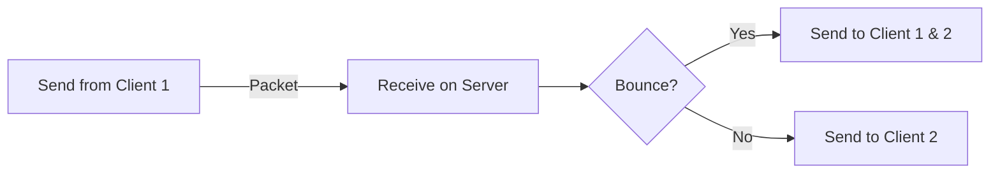

---
layout:
  title:
    visible: true
  description:
    visible: true
  tableOfContents:
    visible: true
  outline:
    visible: true
  pagination:
    visible: false
---

# Modding Fika

## Fika Events

Fika has a lot of events that you can subscribe to, which makes it easier to run code at certain key moments of the raid. To subscribe to an event, use:

```cs
public static void SubscribeEvent<TEvent>(Action<TEvent> callback) where TEvent : FikaEvent
```

To unsubscribe, use:

```cs
public static void UnsubscribeEvent<TEvent>(Action<TEvent> callback) where TEvent : FikaEvent
```

The event triggered will usually pass an important object related to the event, e.g. `FikaNetworkManagerCreatedEvent` passes a `IFikaNetworkManager` (named `Manager` in the object). This object can then be accessed if needed.

You can read the source code [here](https://github.com/project-fika/Fika-Plugin/tree/main/Fika.Core/Modding) to find all events.

## Registering Packets

To register packets, subscribe to the `FikaNetworkManagerCreatedEvent` and access the `IFikaNetworkManager`. In the manager you can call either of these methods:

```cs
public void RegisterPacket<T>(Action<T> handle) where T : INetSerializable, new();
```

```cs
public void RegisterPacket<T, TUserData>(Action<T, TUserData> handle) where T : INetSerializable, new();
```

The `INetSerializable` needs to be a packet that you have created, and these methods are invoked when that packet is received. The second method also passes the `NetPeer`, which can be used to filter "packet bouncing" when received on the `FikaServer`. You handle the logic you want when receiving the packet in these methods.


Failing to register a packet will result in endless `exceptions` being thrown. Please register your packets correctly!


## Creating a Packet

To create a packet, implement the `INetSerializable` interface into a new `class`. For packets that are sent often, I highly recommend using a `struct`. Add the data that you need in the form of `Field` and make all of them `public`. Then use the `Serialize()` and `Deserialize()` to write/read data. You can find an example [here](https://github.com/project-fika/Fika-Plugin/blob/main/Fika.Core/Networking/Packets/Communication/BotStatePacket.cs), which also includes how to write an `enum`. There are also a lot of extensions to write EFT/Unity specific data (e.g. `Vector3`) that you can find [here](https://github.com/project-fika/Fika-Plugin/blob/main/Fika.Core/Networking/FikaSerializationExtensions.cs).

## Sending a Packet

To send a packet, you need a `IFikaNetworkManager`. This is either a `FikaServer` or `FikaClient` that you can access with the `Comfort.Common` using e.g. `Singleton<FikaServer>.Instance`. To determine whether you are a server or client, use `FikaBackendUtils.IsServer`.

#### Server

Use either of these methods:

```cs
public void SendDataToPeer<T>(NetPeer peer, ref T packet, DeliveryMethod deliveryMethod) where T : INetSerializable
```

```cs
public void SendDataToAll<T>(ref T packet, DeliveryMethod deliveryMethod, NetPeer peerToExclude = null) where T : INetSerializable
```

`SendDataToPeer` can be used to send a packet to just one `NetPeer` (which is useful for a response callback). `SendDataToAll` sends data to all clients, you can use the `peerToExclude` to exclude one `NetPeer`, which is useful if you don't want to "bounce" a packet back to the sender, but relay it to other clients. An example of this can be found [here](https://github.com/project-fika/Fika-Plugin/blob/28a1a94361feb89b170dc40e80e81ee767a185c1/Fika.Core/Networking/FikaServer.cs#L1180). In this scenario, we receive a player state and send it to everyone else, except for the one sending it as they are not interested in their own state.



#### Client

Use this method:

```cs
public void SendData<T>(ref T packet, DeliveryMethod deliveryMethod) where T : INetSerializable
```

It sends data to the server.


A client only has one `NetPeer` and it is the server! A client is never aware of other clients.


## Tips and useful classes

[FikaBackendUtils](https://github.com/project-fika/Fika-Plugin/blob/main/Fika.Core/Coop/Utils/FikaBackendUtils.cs) has tons of useful methods/properties/fields that can be used.

[FikaGlobals](https://github.com/project-fika/Fika-Plugin/blob/main/Fika.Core/Coop/Utils/FikaGlobals.cs) has some helper methods that can be useful during development.
